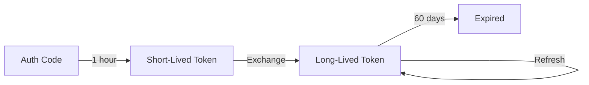

# Access Tokens

Understanding and managing Instagram access tokens.

## Token Types

### Short-Lived Token

- **Duration:** 1 hour
- **Obtained via:** OAuth code exchange
- **Use:** Immediately exchange for long-lived token

### Long-Lived Token

- **Duration:** 60 days
- **Obtained via:** Exchange short-lived token or dashboard
- **Use:** All API requests

## Token Lifecycle



## Getting Tokens

### Via OAuth Flow (Production)

```typescript
import { InstagramOAuth } from 'instagram-graph-api-sdk';

// Exchanges code → short-lived → long-lived automatically
const tokens = await InstagramOAuth.exchangeCodeForToken({
  clientId: process.env.INSTAGRAM_APP_ID!,
  clientSecret: process.env.INSTAGRAM_APP_SECRET!,
  redirectUri: 'https://your-app.com/callback',
  code: authorizationCode,
});

// tokens.access_token is already long-lived!
```

### Via Dashboard (Testing)

1. Go to [Meta App Dashboard](https://developers.facebook.com/apps/)
2. Navigate to **Instagram** → **API setup with Instagram Login**
3. Click **Generate token** next to your account
4. Copy the token (already long-lived)

## Refreshing Tokens

Long-lived tokens can be refreshed if they are:
- At least **24 hours old**
- **Not yet expired**

```typescript
import { InstagramClient } from 'instagram-graph-api-sdk';

const client = new InstagramClient({
  accessToken: userAccessToken,
});

// Refresh the token
const refreshed = await client.auth.refreshToken();

console.log('New token:', refreshed.access_token);
console.log('Expires in:', refreshed.expires_in, 'seconds');

// Save the new token!
```

:::tip Automate Refreshes
Set up a cron job to refresh tokens weekly. This ensures tokens never expire.
:::

## Checking Token Info

Get info about the current token:

```typescript
const me = await client.auth.me('id,username,account_type');

console.log('User ID:', me.id);
console.log('Username:', me.username);
console.log('Account Type:', me.account_type);
```

## Error Handling

```typescript
import { isAuthenticationError } from 'instagram-graph-api-sdk';

try {
  const profile = await client.users.getProfile();
} catch (error) {
  if (isAuthenticationError(error)) {
    // Token is invalid or expired
    // Redirect user to re-authenticate
    console.log('Please log in again');
  }
}
```

## Best Practices

### 1. Store Tokens Securely
- Use encrypted database columns
- Never log tokens
- Never send tokens to client-side

### 2. Handle Expiration
- Track token expiration dates
- Refresh proactively (e.g., 7 days before expiry)
- Handle auth errors gracefully

### 3. Multi-User Apps
```typescript
// Store per-user tokens
const userToken = await database.getTokenForUser(userId);

// Create client for specific user
const client = new InstagramClient({
  accessToken: userToken,
});
```
