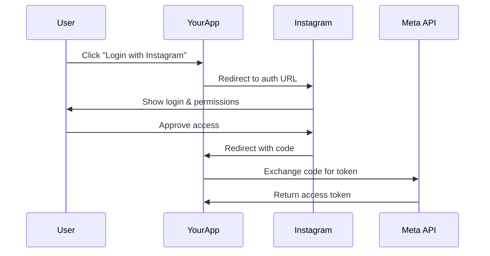

# OAuth Overview

Instagram Business Login uses OAuth 2.0 for authentication. This guide explains the flow and how the SDK helps.

## The OAuth Flow



## Token Types

| Token Type | Duration | Use Case |
|------------|----------|----------|
| **Authorization Code** | 1 hour | Exchange for access token |
| **Short-Lived Token** | 1 hour | Immediately exchange for long-lived |
| **Long-Lived Token** | 60 days | Use for API calls |

## SDK OAuth Helpers

The SDK provides the `InstagramOAuth` class for handling the entire flow:

```typescript
import { InstagramOAuth } from 'instagram-graph-api-sdk';
```

### Step 1: Build Authorization URL

Create the URL to redirect users to Instagram:

```typescript
const authUrl = InstagramOAuth.buildAuthorizationUrl({
  clientId: process.env.INSTAGRAM_APP_ID!,
  redirectUri: 'https://your-app.com/callback',
  scopes: InstagramOAuth.getDefaultScopes(),
  state: 'random-state-for-csrf', // IMPORTANT for security
});

// Redirect user to authUrl
```

### Step 2: Handle Callback

Parse the callback URL when user returns:

```typescript
// In your callback route handler
const callbackUrl = 'https://your-app.com/callback?code=ABC...&state=random-state';

const { code, state, error } = InstagramOAuth.parseCallback(callbackUrl);

if (error) {
  console.error('User denied access:', error);
  return;
}

// Verify state matches what you sent!
if (state !== savedState) {
  throw new Error('CSRF detected!');
}
```

### Step 3: Exchange Code for Token

Get a long-lived access token:

```typescript
const tokens = await InstagramOAuth.exchangeCodeForToken({
  clientId: process.env.INSTAGRAM_APP_ID!,
  clientSecret: process.env.INSTAGRAM_APP_SECRET!,
  redirectUri: 'https://your-app.com/callback',
  code: code,
});

console.log('Access Token:', tokens.access_token);
console.log('User ID:', tokens.user_id);
console.log('Expires in:', tokens.expires_in, 'seconds');

// Save tokens.access_token to your database!
```

### Step 4: Use the Token

Create a client with the user's token:

```typescript
import { InstagramClient } from 'instagram-graph-api-sdk';

const client = new InstagramClient({
  accessToken: tokens.access_token,
});

const profile = await client.users.getProfile();
console.log(`Logged in as @${profile.username}`);
```

## Available Scopes

| Scope | Description |
|-------|-------------|
| `instagram_business_basic` | Read profile and media |
| `instagram_business_content_publish` | Publish posts |
| `instagram_business_manage_comments` | Moderate comments |
| `instagram_business_manage_messages` | Read/send DMs |

```typescript
// Get default scopes (recommended)
const scopes = InstagramOAuth.getDefaultScopes();
// ['instagram_business_basic', 'instagram_business_manage_messages', 
//  'instagram_business_manage_comments', 'instagram_business_content_publish']

// Or get all available scopes
const allScopes = InstagramOAuth.getAllScopes();
```

## Security Tips

:::warning CSRF Protection
Always use the `state` parameter and verify it on callback to prevent CSRF attacks.
:::

:::danger Server-Side Only
Token exchange must happen server-side. Never expose your App Secret to the client.
:::

## Next Steps

- [Access Tokens](/authentication/access-tokens) - Token lifecycle and refresh
- [SDK OAuth](/authentication/sdk-oauth) - Full implementation example
